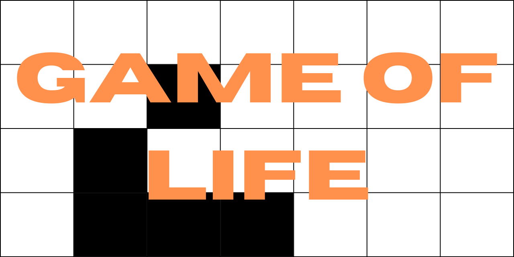
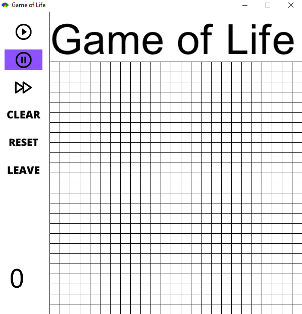

##To run the game of life, install the required dependencies with the `bundle install` command.
##Then, run the file named `index.rb`. A window like that will appear.

###Click on a cell to change its state, use the left buttons to run, pause, clear, reset or stop the game.

#Have fun! 👋